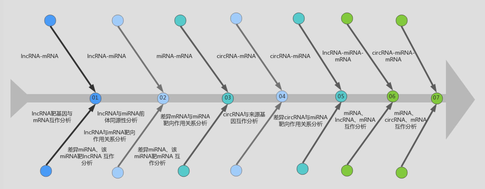
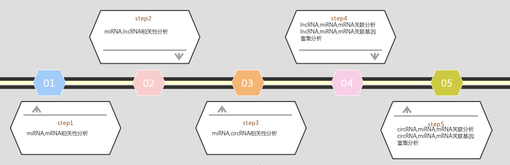

 


<h6 style="text-align:right">北京康普森生物科技有限公司</h6>

*****

<br/>

#**全转录组关联分析报告**


###<font color=##3299CD>WTS  content</font>
**一、lncRNA与mRNA关联分析**

**二、lncRNA与miRNA关联分析**

2.1、lncRNA与miRNA前体的同源性

2.2、miRNA与target lncRNA 靶向关系分析

2.3、差异 miRNA与target lncRNA互作分析

**三、miRNA与mRNA关联分析**

3.1差异miRNA的靶基因筛选

3.2差异miRNA、靶基因互作分析

**四.circRNA 与mRNA关联分析**

**五.circRNA和miRNA关联分析**

**六.lncRNA、miRNA与mRNA的调控网络**

**七.circRNA、miRNA与mRNA的调控网络**


###<font color=##3299CD>ceRNA content</font>

**一、miRNA与mRNA关联分析**

**二、miRNA与circRNA关联分析**

**三、miRNA与lncRNA关联分析**

**四. lncRNA、miRNA 与mRNA 关联分析**

4.1 lncRNA、miRNA 与mRNA表达水平相关性分析

4.2 lncRNA、miRNA 与mRNA三者具有关联性的基因富集分析

**五. circRNA、miRNA与mRNA 关联分析**

5.1 circRNA、miRNA 与mRNA表达水平相关性分析

5.2 circRNA、miRNA 与mRNA三者具有关联性的基因富集分析

*****

<h6 style="text-align:right">北京康普森生物科技有限公司</h6>

*****
<br/>

###<font color=##3299CD>WTS  分析流程图</font>



<br/>

###<font color=##3299CD>ceRNA  分析流程图</font>




*****


<h6 style="text-align:right">北京康普森生物科技有限公司</h6>
*****

<br/>


   
##<font>WTS分析</font>    
###<font color=##3299CD>一、lncRNA与mRNA关联分析</font>

&emsp;&emsp;LncRNA通过co-location或co-expression调控靶基因(mRNA)的表达。针对lncRNA与mRNA的关联分析，我们通过对差异表达lncRNA的靶基因与差异表达的mRNA进行交集分析，当lncRNA的靶基因同时也是显著差异的mRNA时，该差异mRNA受到lncRNA直接或间接调控作用的可能性更大。当项目样品数<5时，我们选取co-location作用的靶基因与差异表达的mRNA进行分析。当样品数≥5时，则选取co-location和co-expression作用的靶基因并集与差异表达的mRNA进行分析。对差异表达lncRNA的靶基因与差异表达的mRNA的交集以韦恩图展示。

```{r echo=FALSE}
library(stringr)
library(bsselectR)
state_plots <- paste0(list.files("src/file/wts/m1","*DEG_Venn_diagram.png*",full.names=TRUE))
names(state_plots) <- str_replace_all(state_plots,c("\\.png"="","file/"=""))
bsselect(state_plots,type="img",height='20%',width='40%',selected=,live_search=TRUE,show_tick=TRUE)
```


###<font color=##3299CD>二、lncRNA与miRNA关联分析</font>
####<font color=##3299CD>2.1、lncRNA与miRNA前体的同源性</font>

&emsp;&emsp;lncRNA可以作为miRNA的前体分子，可以依据lncRNA与miRNA前体的同源性来寻找这一类lncRNA。

|hairpin_id |hairpin_start| hairpin_end|lnc_id|lnc_start |lnc_end|
|:--:|:--:|:--:|:--:|
|mmu-mir-3470b|4|125|LNC_000008|84|205|
|mmu-mir-3470b|7|124|LNC_000140|4583|4704|
|mmu-mir-1194|2|121|LNC_000154|172|297|
|mmu-mir-3473h|3|61|LNC_000359|330|388|
|mmu-mir-1194|1|121|LNC_000821|197|323|

**1. hairpin_id:miRNA前体的id**<br/>
**2. hairpin_start:miRNA前体与lnc同源的部分在miRNA前体上的起始位置**<br/>
**3. hairpin_end:miRNA前体与lnc同源的部分在miRNA前体上的终止位置**<br/>
**4. lnc_id:lncRNAid**<br/>
**5. lnc_start:lncRNA与miRNA前体同源的部分在lncRNA上的起始位置**<br/>
**6. lnc_end:lncRNA与miRNA前体同源的部分在lncRNA上的终止位置**<br/>

####<font color=##3299CD>2.2 miRNA与target lncRNA靶向关系分析 </font>

&emsp;&emsp;miRNA可以结合lncRNA，影响lncRNA功能发挥(lncRNA也可吸附miRNA，影响miRNA功能)。miRNA的靶向lncRNA预测，可分别通过miRanda软件和psRobot软件，预测动物样本和植物样本中miRNA的靶向lncRNA。

|miRNA|lncRNA|
|:--:|:--:|
|mmu-let-7a-1-3p|ENSMUST00000097531.2|
|mmu-let-7a-1-3p|ENSMUST00000124122.7|
|mmu-let-7a-1-3p|ENSMUST00000124210.7|
|mmu-let-7a-1-3p|ENSMUST00000129364.1|
|mmu-let-7a-1-3p|ENSMUST00000134580.1|


**1. 第一列为miRNA id**<br/>
**2. 第二列为靶lncRNA id**<br/>

####<font color=##3299CD>2.3、差异miRNA与target lncRNA互作分析</font>

&emsp;&emsp;各比较组合miRNA-target-lncRNA全部的结果;下调的miRNA与上调的target lncRNA分析结果;上调的miRNA与下调的target lncRNA分析结果:

```{r echo=FALSE}
library(stringr)
library(bsselectR)
state_plots <- paste0(list.files("src/file/wts/m2","*.png*",full.names=TRUE))
names(state_plots) <- str_replace_all(state_plots,c("\\.png"="","file/"=""))
bsselect(state_plots,type="img",height='20%',width='40%',selected=,live_search=TRUE,show_tick=TRUE)
```

###<font color=##3299CD>三、miRNA与mRNA关联分析</font>
###<font color=##3299CD>3.1差异miRNA的靶基因筛选</font>

|miRNA|lncRNA|
|:--:|:--:|
|mmu-miR-155-5p|ENSMUSG00000000003|
|mmu-miR-6959-5p|ENSMUSG00000000003|
|mmu-miR-1249-5p|ENSMUSG00000020875|
|mmu-miR-143-5p|ENSMUSG00000020875|
|mmu-miR-149-3p|ENSMUSG00000020875|

**1. 第一列为miRNA id**<br/>
**2. 第二列为靶lncRNA id**<br/>

####<font color=##3299CD>3.2差异miRNA、靶基因互作分析</font>

```{r echo=FALSE}
library(stringr)
library(bsselectR)
state_plots <- paste0(list.files("src/file/wts/m2","*change.png*",full.names=TRUE))
names(state_plots) <- str_replace_all(state_plots,c("\\.png"="","file/"=""))
bsselect(state_plots,type="img",height='20%',width='40%',selected=,live_search=TRUE,show_tick=TRUE)
```

#####<font color=##3299CD>3.2.1靶基因GO富集分析</font>

&emsp;&emsp;从GO富集分析结果中，选取最显著的30个Term绘制柱状图进行展示，若不足30个，则绘制所有Term信息，结果如下图所示：

```{r echo=FALSE}
library(stringr)
library(bsselectR)
state_plots <- paste0(list.files("src/file/wts/m3","*GO_classification.png*",full.names=TRUE))
names(state_plots) <- str_replace_all(state_plots,c("\\.png"="","file/"=""))
bsselect(state_plots,type="img",height='20%',width='40%',selected=,live_search=TRUE,show_tick=TRUE)
```


&emsp;&emsp;有向无环图（Directed Acyclic Graph，DAG）为来源基因GO富集分析结果的图形化展示方式，分支代表包含关系，从上至下所定义的功能范围越来越小，取GO富集分析的结果前10位作为有向无环图的主节点，并通过包含关系，将相关联的GO Term一起展示，颜色的深浅代表富集程度。再分别绘制生物过程（biological process）、分子功能（molecular function）和细胞组分（cellular component）的来源基因 DAG 图，结果如下图所示：

```{r echo=FALSE}
library(stringr)
library(bsselectR)
state_plots <- paste0(list.files("src/file/wts/m3","*DAG.png*",full.names=TRUE))
names(state_plots) <- str_replace_all(state_plots,c("\\.png"="","file/"=""))
bsselect(state_plots,type="img",height='20%',width='40%',selected=,live_search=TRUE,show_tick=TRUE)

```

#####<font color=##3299CD>3.2.2靶基因KEGG富集分析</font>

&emsp;&emsp;从KEGG富集结果中，选取最显著的20个通路绘制散点图进行展示，若不足20个，则绘制所有通路信息，结果如下图所示：

```{r echo=FALSE}
library(stringr)
library(bsselectR)
state_plots <- paste0(list.files("src/file/wts/m3","*enriched_KEGG_pathway_scatterplot.png*",full.names=TRUE))
names(state_plots) <- str_replace_all(state_plots,c("\\.png"="","file/"=""))
bsselect(state_plots,type="img",height='20%',width='40%',selected=,live_search=TRUE,show_tick=TRUE)
```


#####<font color=##3299CD>3.2.3network图展示</font>

&emsp;&emsp;我们提供差异表达miRNA(上调/下调、qvalue【即校正后的 pvalue】)和mRNA之间的靶作用关系数据文件，并且提供了mRNA和miRNA作用的网络图，具体见结果文件，同时也可以根据实际需要将miRNA和mRNA之间的靶作用关系数据文件直接导入Cytoscape软件进行可视化编辑。

```{r echo=FALSE}
library(stringr)
library(bsselectR)
state_plots <- paste0(list.files("src/file/wts/m3","*network.png*",full.names=TRUE))
names(state_plots) <- str_replace_all(state_plots,c("\\.png"="","file/"=""))
bsselect(state_plots,type="img",height='20%',width='40%',selected=,live_search=TRUE,show_tick=TRUE)
```

###<font color=##3299CD>四.circRNA与mRNA关联分析</font>


&emsp;&emsp;转录形成circRNA的基因(circRNA的来源基因)通常也可以转录形成线性mRNA，circRNA表达水平变化可能会影响其来源基因mRNA的表达水平变化，对circRNA与其来源基因mRNA表达水平相关性分析，对研究mRNA表达水平调控机制具有重要意义。


```{r echo=FALSE}
library(stringr)
library(bsselectR)
state_plots <- paste0(list.files("src/file/wts/m4","*expression_cor_file.png*",full.names=TRUE))
names(state_plots) <- str_replace_all(state_plots,c("\\.png"="","file/"=""))
bsselect(state_plots,type="img",height='20%',width='40%',selected=,live_search=TRUE,show_tick=TRUE)
```
&emsp;&emsp;对差异表达circRNA的来源基因和差异表达mRNA取交集，可以获知样本之间circRNA的差异表达是否能够反映来源基因对应的mRNA也出现表达水平变化。venn图展示如下：

```{r echo=FALSE}
library(stringr)
library(bsselectR)
state_plots <- paste0(list.files("src/file/wts/m4","*DEG_Venn_diagram.png*",full.names=TRUE))
names(state_plots) <- str_replace_all(state_plots,c("\\.png"="","file/"=""))
bsselect(state_plots,type="img",height='20%',width='40%',selected=,live_search=TRUE,show_tick=TRUE)
```

###<font color=##3299CD>五.circRNA和miRNA关联分析</font>
&emsp;&emsp;差异表达的circRNA结合的miRNA

|miRNA|circRNA|
|:--:|:--:|
|mmu-let-7a-1-3p|novel_circ_0000046|
|mmu-let-7a-1-3p|novel_circ_0006723|
|mmu-let-7a-1-3p|novel_circ_0008022|
|mmu-let-7a-5p|mmu_circ_0001244|
|mmu-let-7a-5p|mmu_circ_0001263|


**1. 第一列为miRNA id**<br/>
**2. 第二列为miRNA target circRNA id**<br/>

###<font color=##3299CD>六.lncRNA、miRNA与mRNA的调控网络</font>

&emsp;&emsp;ncRNA具有广泛的调控作用，不仅能够直接调控DNA的结构、RNA的转录和翻译，而且具有miRNA结合位点，可以作为miRNAspong竞争性地结合miRNA，抑制miRNA对靶基因的调节作用，从而间接地调控基因表达。基于ceRNA理论，寻找拥有相同miRNA结合位点的lncRNA-gene pairs，构建以lncRNA为decoy、miRNA为核心、mRNA为靶标的lncRNA–iRNA-gene pairs，构建ceRNA调控网络。在全转录组层面，通过ceRNA调控网络，揭示ncRNA调控基因表达的机制。

&emsp;&emsp;根据获得的lncRNA-miRNA-gene pairs，构建互作网络，利用cytoscape软件进行可视化展示。不同的形状代表不同的RNA种类，不同颜色代表上下调关系，不同的节点(node)的大小与此节点的度(degree)成正比，即与此节点相连的边越多，它的度越大，节点也就越大，这些节点在网络中可能处于较为核心的位置，与所研究的生物学问题更相关。


```{r echo=FALSE}
library(stringr)
library(bsselectR)
state_plots <- paste0(list.files("src/file/wts/m7","*network.png*",full.names=TRUE))
names(state_plots) <- str_replace_all(state_plots,c("\\.png"="","file/"=""))
bsselect(state_plots,type="img",height='20%',width='40%',selected=,live_search=TRUE,show_tick=TRUE)
```


###<font color=##3299CD>七.circRNA、miRNA与mRNA的调控网络</font>

&emsp;&emsp;circRNA具有miRNA结合位点，可以作为miRNAspong竞争性地结合miRNA, 抑制miRNA对靶基因的调节作用，从而间接地调控基因表达。基于ceRNA理论，寻找拥有相同miRNA结合位点的circRNA-gene pairs，构建以circRNA为decoy、miRNA为核心、mRNA为靶标的circRNA-miRNA-gene pairs，构建ceRNA调控网络。在全转录组层面，利用ceRNA调控网络，揭示ncRNA调控基因表达新机制。


&emsp;&emsp;根据获得的circRNA-miRNA-gene pairs，构建互作网络，利用cytoscape软件进行可视化展示。不同的形状代表不同的RNA种类，不同颜色代表上下调关系，不同的节点(node)的大小与此节点的度(degree)成正比，即与此节点相连的边越多，它的度越大，节点也就越大，这些节点在网络中可能处于较为核心的位置，与所研究的生物学问题更相关。

*******
```{r echo=FALSE}
library(stringr)
library(bsselectR)
state_plots <- paste0(list.files("src/file/wts/m7","*network.png*",full.names=TRUE))
names(state_plots) <- str_replace_all(state_plots,c("\\.png"="","file/"=""))
bsselect(state_plots,type="img",height='20%',width='40%',selected=,live_search=TRUE,show_tick=TRUE)
```

*****

<h6 style="text-align:right">北京康普森生物科技有限公司</h6>
*****
    
<br/>

 
    

###<font color=##3299CD>ceRNA  分析流程图</font>    

&emsp;&emsp;RNA之间可以通过竞争结合共同的microRNA反应元件(microRNA response element, MRE)实现相互调节，这种调控模式构成竞争性内源RNA(Competing endogenous RNA, ceRNA)。已发现的ceRNA包括蛋白编码mRNA和非编码RNA，其中后者包括假基因转录物、长链非编码RNA(Long non-coding RNA, lncRNA)、环状RNA(Circular RNA, circRNA)等。

&emsp;&emsp;分析思路：circRNA可以通过与miRNA结合的方式吸附miRNA，具有miRNA sponge功能。利用miRNA干扰或者抑制靶基因的原理，预测miRNA靶向的lncRNA，miRNA靶向的mRNA，miRNA靶向的circRNA。计算miRNA与lncRNA的相关性系数，选择负相关；计算miRNA与mRNA的相关性系数，选择负相关；计算miRNA与circRNA的相关性系数，选择负相关。基于ceRNA的研究结果，选择出miRNA共同调节的mRNA与lncRNA，circRNA。


###<font color=##3299CD>一、miRNA与mRNA关联分析</font>

&emsp;&emsp;计算所有miRNA、与该miRNA具有靶向关系的mRNA的皮尔森相关性系数，阈值:负相关，具体数值可根据文献进行调整。

|miRNA ID|mRNA ID|pearson value|P value|
|:--:|:--:|:--:|:--:|
|mmu-miR-1195|ENSMUST00000114900|-0.904073269607|5.43523965845e-05|
|mmu-miR-12194-3p|ENSMUST00000023709|-0.937942696124|6.52767013128e-06|
|mmu-miR-1224-5p|ENSMUST00000023709|-0.933559595423|9.11387571401e-06|
|mmu-miR-1224-5p|ENSMUST00000025912|-0.934640204242|8.41196455431e-06|
|mmu-miR-1249-5p|ENSMUST00000115099|-0.901946659845|6.04274706032e-05|


**1. 第一列为miRNA id**<br/>
**2. 第二列为miRNA 靶向RNA id**<br/>
**3. 第三列为pearson相关性系数**<br/>
**4. 第四列为p值**<br/>

###<font color=##3299CD>二、miRNA与lncRNA关联分析</font>

&emsp;&emsp;对于动物和植物，分别使用 miRanda 和 psRobot软件预测所有miRNA的靶向lncRNA。再计算miRNA、与该miRNA具有靶向关系的lncRNA的皮尔森相关性系数，阈值:负相关，具体数值可根据文献进行调整。


|miRNA ID|lncRNA ID|pearson value|P value|
|:--:|:--:|:--:|:--:|
|mmu-let-7a-5p|ENSMUST00000070085.5|-0.918437918141|2.47583420336e-05|
|mmu-let-7a-5p|ENSMUST00000206829.1|-0.904513187419|5.31579078102e-05|
|mmu-let-7a-5p|ENSMUST00000180955.1|-0.905334042461|5.09842957614e-05|
|mmu-let-7a-5p|ENSMUST00000129065.7|-0.906288622407|4.85451006449e-05|
|mmu-let-7d-5p|ENSMUST00000167899.2|-0.913786941298|3.24091911883e-05|


**1. 第一列为miRNA id**<br/>
**2. 第二列为miRNA 靶向lncRNA id**<br/>
**3. 第三列为pearson相关性系数**<br/>
**4. 第四列为p值**<br/>

###<font color=##3299CD>三、miRNA与circRNA关联分析</font>
&emsp;&emsp;计算所有miRNA、与该miRNA具有靶向关系的circRNA的皮尔森相关性系数，阈值:负相关，具体数值可根据文献进行调整。

|miRNA ID|circRNA ID|pearson value|P value|
|:--:|:--:|:--:|:--:|
|mmu-miR-3093-5p|mmu_circ_0001633|-0.924249169327|1.72803586247e-05|
|mmu-miR-412-3p|mmu_circ_0000233|-0.945058044456|3.59402870352e-06|
|mmu-miR-758-3p|mmu_circ_0001704|-0.917241248585|2.65739218915e-05|


**1. 第一列为miRNA id**<br/>
**2. 第二列为miRNA 靶向circRNA id**<br/>
**3. 第三列为pearson相关性系数**<br/>
**4. 第四列为p值**<br/>

###<font color=##3299CD>四.lncRNA、miRNA 与mRNA 关联分析</font>
                                                             
&emsp;&emsp;筛选miRNA，与该miRNA具有靶向关系、表达呈负相关的mRNA，且与该miRNA具有靶向关系、表达呈负相关的lncRNA。


|miRNA ID|lncRNA ID|pearson value|P value|mRNA ID|pearson value|P value|
|:--:|:--:|:--:|:--:|:--:|:--:|:--:|
|mmu-miR-1195|ENSMUST00000181536.2|-0.971541848646|1.40143489881e-07|ENSMUST00000114900|-0.904073269607|5.43523965845e-05|
|mmu-miR-12194-3p|LNC_006440|-0.941732011609|4.79458186047e-06|ENSMUST00000023709|-0.937942696124|6.52767013128e-06|
|mmu-miR-1224-5p|LNC_006441|-0.91852960099|2.46233842281e-05|ENSMUST00000023709|-0.933559595423|9.11387571401e-06|
|mmu-miR-1224-5p|LNC_006441|-0.91852960099|2.46233842281e-05|ENSMUST00000025912|-0.934640204242|8.41196455431e-06|
|mmu-miR-125a-3p|ENSMUST00000149940.1|-0.922851964857|1.88885473332e-05|ENSMUST00000027861|-0.914086760241|3.18660142407e-05|

**1. 第一列为miRNA id**<br/>
**2. 第二列为lncRNA id**<br/>
**3. 第三列为pearson相关性系数(miRNAvslncRNA)**<br/>
**4. 第四列为p值(miRNAvslncRNA)**<br/>
**5. 第五列为mRNA_transcript_id**<br/>
**3. 第六列为pearson相关性系(miRNAvsmRNA)**<br/>
**3. 第七列为p值(miRNAvsmRNA)**<br/>


####<font color=##3299CD>GO分析</font>

&emsp;&emsp;从GO富集分析结果中，选取最显著的30个Term绘制柱状图进行展示，若不足30个，则绘制所有Term信息，结果如下图所示：

```{r echo=FALSE}
library(stringr)
library(bsselectR)
state_plots <- paste0(list.files("src/file/ce/m4","*CAD_Enriched_GO_classification.png*",full.names=TRUE))
names(state_plots) <- str_replace_all(state_plots,c("\\.png"="","file/"=""))
bsselect(state_plots,type="img",height='20%',width='40%',selected=,live_search=TRUE,show_tick=TRUE)
```


&emsp;&emsp;有向无环图（Directed Acyclic Graph，DAG）为来源基因 GO 富集分析结果的图形化展示方式，分支代表包含关系，从上至下所定义的功能范围越来越小，一
般选取GO富集分析的结果前 10 位作为有向无环图的主节点，并通过包含关系，将相关联的 GO Term 一起展示，颜色的深浅代表富集程度。我们的项目中分别绘制生物过程
（biological process）、分子功能（molecular function）和细胞组分（cellular component）的来源基因 DAG 图，结果如下图所示：

```{r echo=FALSE}
library(stringr)
library(bsselectR)
state_plots <- paste0(list.files("src/file/ce/m4","*DAG.png*",full.names=TRUE))
names(state_plots) <- str_replace_all(state_plots,c("\\.png"="","file/"=""))
bsselect(state_plots,type="img",height='20%',width='40%',selected=,live_search=TRUE,show_tick=TRUE)
```

####<font color=##3299CD>KEGG分析</font>
&emsp;&emsp;从KEGG富集结果中，选取最显著的20个通路绘制散点图进行展示，若不足20个，则绘制所有通路信息，结果如下图所示：

```{r echo=FALSE}
library(stringr)
library(bsselectR)
state_plots <- paste0(list.files("src/file/ce/m4","*lncRNA_miRNA_mRNA.enriched_KEGG_pathway_scatterplot.png*",full.names=TRUE))
names(state_plots) <- str_replace_all(state_plots,c("\\.png"="","file/"=""))
bsselect(state_plots,type="img",height='20%',width='40%',selected=,live_search=TRUE,show_tick=TRUE)
```

###<font color=##3299CD>五.circRNA、miRNA 与mRNA 关联分析</font>

&emsp;&emsp;筛选miRNA，与该miRNA具有靶向关系、表达呈负相关的mRNA，且与该miRNA具有靶向关系、表达呈负相关的circRNA。


|miRNA ID|circRNA ID|pearson value|P value|mRNA ID|pearson value|P value|
|:--:|:--:|:--:|:--:|:--:|:--:|:--:|


**1. 第一列为miRNA id**<br/>
**2. 第二列为circRNA id**<br/>
**3. 第三列为pearson相关性系数(miRNAvscircRNA)**<br/>
**4. 第四列为p值(miRNAvscircRNA)**<br/>
**5. 第五列为mRNA_transcript_id**<br/>
**3. 第六列为pearson相关性系(miRNAvsmRNA)**<br/>
**3. 第七列为p值(miRNAvsmRNA)**<br/>

####<font color=##3299CD>GO分析</font>
&emsp;&emsp;从GO富集分析结果中，选取最显著的30个Term绘制柱状图进行展示，若不足30个，则绘制所有Term信息，结果如下图所示：

```{r echo=FALSE}
library(stringr)
library(bsselectR)
state_plots <- paste0(list.files("src/file/ce/m5","*CAD_Enriched_GO_classification.png*",full.names=TRUE))
names(state_plots) <- str_replace_all(state_plots,c("\\.png"="","file/"=""))
bsselect(state_plots,type="img",height='20%',width='40%',selected=,live_search=TRUE,show_tick=TRUE)
```


&emsp;&emsp;有向无环图（Directed Acyclic Graph，DAG）为来源基因 GO 富集分析结果的图形化展示方式，分支代表包含关系，从上至下所定义的功能范围越来越小，一般选取GO富集分析的结果前 10 位作为有向无环图的主节点，并通过包含关系，将相关联的 GO Term 一起展示，颜色的深浅代表富集程度。我们的项目中分别绘制生物过程（biological process）、分子功能（molecular function）和细胞组分（cellular component）的来源基因 DAG 图，结果如下图所示：

```{r echo=FALSE}
library(stringr)
library(bsselectR)
state_plots <- paste0(list.files("src/file/ce/m5","*DAG.png*",full.names=TRUE))
names(state_plots) <- str_replace_all(state_plots,c("\\.png"="","file/"=""))
bsselect(state_plots,type="img",height='20%',width='40%',selected=,live_search=TRUE,show_tick=TRUE)
```


####<font color=##3299CD>KEGG分析</font>
&emsp;&emsp;从KEGG富集结果中，选取最显著的20个通路绘制散点图进行展示，若不足20个，则绘制所有通路信息，结果如下图所示：

```{r echo=FALSE}
library(stringr)
library(bsselectR)
state_plots <- paste0(list.files("src/file/ce/m5","*circRNA_miRNA_mRNA.enriched_KEGG_pathway_scatterplot.png*",full.names=TRUE))
names(state_plots) <- str_replace_all(state_plots,c("\\.png"="","file/"=""))
bsselect(state_plots,type="img",height='20%',width='40%',selected=,live_search=TRUE,show_tick=TRUE)
```

*****

<h6 style="text-align:right">北京康普森生物科技有限公司</h6>
*****

<br/>

    

    
###<font color=##3299CD>参考文献</font>

1、Salmena L, Poliseno L, Tay Y, Kats L and Pandolf PP.A ceRNA hypothesis: the Rosetta Stone of a hidden RNA language? Cell. 2011; 146:353-358. 

2、Tay Y, Rinn J and Pandolf PP. The multilayered complexity of ceRNA crosstalk and competition. Nature.2014; 505:344-352.

3、Zhou L., Chen J., Li Z., Li X., Hu X., et al. (2010). Integrated profiling of microRNAs and mRNAs: microRNAs located on Xq27.3 associate with clear cell renal cell carcinoma. PLoS One 5: e15224. (TPM)

4、Storey, J. D. (2003). The positive false discovery rate: A Bayesian interpretation and the q-value, Annals of Statistics. 31: 2013-2035.(qvalue)

5、Young, M.D., Wakefield, M.J., Smyth, G.K., and Oshlack, A. goseq: Gene Ontology testing for RNA-seq datasets.(goseq)

6、Mao, X., Cai, T., Olyarchuk, J.G., and Wei, L. (2005). Automated genome annotation and pathway identification using the KEGG orthology (KO) as a controlled vocabulary. Bioinformatics 21,3787–3793.(KOBAS)

7、Kanehisa M, Araki M, Goto S, Hattori M, Hirakawa M, et al. (2008). KEGG for linking genomes to life and the environment. Nucleic Acids research36:D480–484. ( KEGG)

8、Qun He, Linli Tian, Hao Jiang, Jiarui Zhang, Qiang Li, Yanan Sun, et al. (2016). JianIdentification of laryngeal cancer prognostic biomarkers using an inflammatory gene-related, competitive endogenous RNA network.Oncotarget8: 9525–9534.

****


